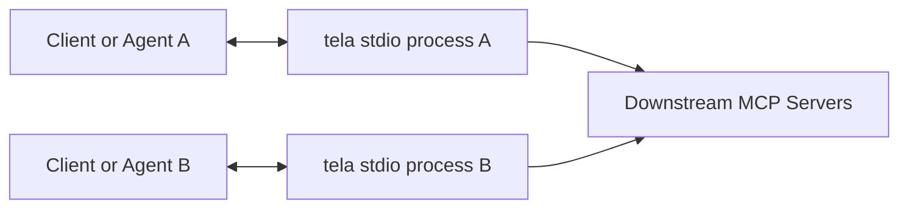
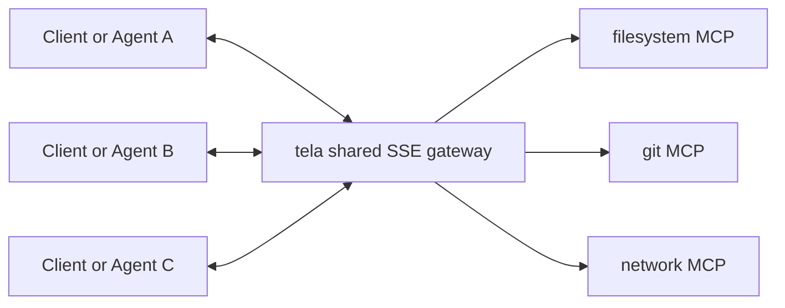

# tela

tela is an MCP aggregation gateway. It connects multiple downstream MCP servers
and exposes them as one upstream MCP endpoint with profile-based tool filtering,
policy enforcement, and audit logging.

## What tela does

- Aggregates multiple MCP servers behind one endpoint
- Applies family-based posture ceilings and per-tool overrides
- Supports open mode or token-based authentication
- Emits structured audit logs at `L1`, `L2`, or `L3`
- Supports local stdio usage and shared SSE gateway mode
- Ships with a built-in profile catalog for common access patterns

## Quick start

1. Install the project.
2. Copy the example config.
3. Start the gateway.

```bash
pip install -e .
cp tela.yaml.example tela.yaml
tela start --config tela.yaml
```

For a more complete walkthrough, see `docs/USAGE.md`.

## Configuration at a glance

tela reads a single YAML config file. The top-level sections are:

- `servers`: downstream MCP servers to connect to
- `profiles`: access control rules for clients
- `auth`: `open` or `token` mode
- `audit`: log verbosity and output path

Use `tela.yaml.example` as the canonical starting point. It includes:

- Full field-by-field comments
- Built-in profile templates
- Custom profile examples
- Open-mode and token-mode notes
- Posture, family, and environment variable reference material

Minimal example:

```yaml
servers:
  fs:
    command: "mcp-filesystem"
    args: ["--root", "/workspace"]
    family: "filesystem"

profiles:
  developer:
    tools:
      filesystem: "read_write"
    side_effect_policy: "allow"
    default: true

auth:
  mode: "open"

audit:
  level: "L2"
  output: "./audit.jsonl"
```

## Running tela

### stdio mode

Use stdio when your MCP client launches `tela` as a child process.

```bash
tela start --config tela.yaml
```

This is the simplest local setup. In practice, each client or agent usually
launches its own `tela` process in stdio mode.

### SSE mode

Use SSE when you want one shared gateway process that multiple clients can use.

```bash
tela start --config tela.yaml --port 8080
```

This starts a long-lived gateway process and exposes it over SSE.

## Connecting an MCP client

### Example: stdio client configuration

```json
{
  "mcpServers": {
    "tela": {
      "command": "tela",
      "args": ["start", "--config", "tela.yaml"]
    }
  }
}
```

### Which mode should you choose?

- `stdio`: best for simple local development and one-client-per-process setups
- `SSE`: best when multiple agents or clients should share the same gateway

## Architecture patterns

### stdio: one client, one tela process

```text
+-------------+        +------------------+        +-------------------+
| MCP Client  | <----> | tela (stdio)     | <----> | downstream MCPs   |
| / Agent A   |        | child process    |        | fs / git / net    |
+-------------+        +------------------+        +-------------------+

+-------------+        +------------------+        +-------------------+
| MCP Client  | <----> | tela (stdio)     | <----> | downstream MCPs   |
| / Agent B   |        | child process    |        | fs / git / net    |
+-------------+        +------------------+        +-------------------+
```



Use this when simplicity matters more than shared runtime state.

### SSE: many clients, one shared tela gateway

```text
                 +----------------------------------+
                 |      tela shared gateway         |
                 |       SSE endpoint :8080         |
                 +----------------+-----------------+
                                  |
                    +-------------+-------------+
                    |             |             |
                    v             v             v
               +---------+   +---------+   +---------+
               |   fs    |   |   git   |   | network |
               | server  |   | server  |   | server  |
               +---------+   +---------+   +---------+

+-------------+    HTTP/SSE    +--------------------------+
| MCP Client  | <----------->  | shared tela SSE endpoint |
| / Agent A   |                +--------------------------+
+-------------+

+-------------+    HTTP/SSE
| MCP Client  | <----------------------------------------+
| / Agent B   |                                          |
+-------------+                                          |
                                                         same gateway
+-------------+    HTTP/SSE                              |
| MCP Client  | <----------------------------------------+
| / Agent C   |
+-------------+
```



Use this when multiple agents should share one tela instance.

## Built-in profiles

tela includes these built-in profile templates:

- `read_only`
- `fetch_external`
- `modify_local`
- `send_external`
- `orchestrate`
- `execute_safe`
- `execute_full`

You can use them as-is, override them by name, or define your own profiles.
See `tela.yaml.example` and `docs/USAGE.md` for concrete examples.

## CLI

```text
tela start [--config path] [--port port] [--default-profile name]
tela status [--json]
tela profiles [--config path] [--json]
tela connections [--json]
tela audit [--json] [--since T] [--limit N]
```

## Common workflow

```bash
cp tela.yaml.example tela.yaml
tela start --config tela.yaml
tela profiles --config tela.yaml --json
tela status --json
```

## Testing

```bash
uv run pytest -q
uv run pytest --doctest-modules src/tela/
uv run invar guard --all
uv run pytest tests/repro/ -q
```

`tests/repro/` is the executable regression suite. If a legacy workflow refers
to `tests/blind/`, use `tests/repro/` as the canonical fallback path.

## Documentation

- `tela.yaml.example`: detailed configuration example
- `docs/USAGE.md`: detailed user guide
- `docs/DESIGN.md`: implementation and architecture detail
- `docs/INTERFACES.md`: external behavior and contract surface

## License

MIT
