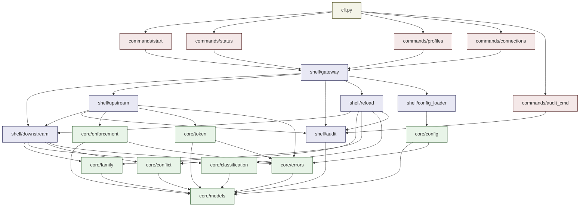

# tela -- Detailed Design

**Status**: Accepted
**Scope**: Module decomposition, inter-module interfaces, and data contracts for mcp-tela.
**Non-scope**: Internal implementation details, algorithms, storage layouts.
**Source documents**: docs/INTERFACES.md, opifex/design/tela-clean-gateway.md, opifex/design/architecture.md, contracts/*.

For operator setup, deployment patterns, and end-user examples, see
`docs/USAGE.md`. For a commented configuration template, see
`tela.yaml.example`.

---

## 1. System Overview

tela is an MCP aggregation gateway. It connects to N downstream MCP servers and
exposes them as a single upstream MCP endpoint with profile-based tool filtering,
capability token authentication, and structured audit logging.

### Core Responsibilities

1. Aggregate downstream MCP servers into one upstream endpoint
2. Enforce profile-based tool access (family admission, posture check, side-effect policy)
3. Validate capability tokens (HMAC-SHA256, dual-key rotation) or operate in open mode
4. Classify tools by posture (via overrides, MCP annotations, or default)
5. Strip `_meta` from tool calls before forwarding to downstream servers
6. Emit structured audit log entries
7. Hot-reload downstream tool lists and configuration without dropping connections
8. Expose CLI commands for status, profiles, connections, and audit queries

### Non-Responsibilities

- Does NOT define or interpret PersonaSpec (profile-only)
- Does NOT own runtime/session state
- Does NOT implement approval gates (that is anima's job)
- Does NOT route events (that is nervus's job)
- Does NOT issue tokens (that is nervus's job; tela only validates)

---

## 2. Architecture Constraints

### From Invar Protocol

| Zone | Path Pattern | Rules |
|------|-------------|-------|
| Core | `src/tela/core/**` | `@pre` + `@post` + doctest required; no I/O imports |
| Shell | `src/tela/shell/**` | Returns `Result[T, E]`; performs I/O |

All pure logic (config parsing/validation, posture comparison, token verification
math, enforcement chain evaluation, tool conflict detection, family mapping) belongs
in Core. All I/O (MCP communication, file reading, process management, audit file
writing, network operations) belongs in Shell.

### From pyproject.toml

- Build: hatchling
- Python: >= 3.11
- Dependencies: fastmcp >= 2.0.0, pydantic >= 2.0, pyyaml >= 6.0
- Entry point: `tela = "tela.cli:main"`
- Package location: `src/tela`

### From opifex Contracts

- CapabilityToken: `contracts/capability_token.schema.json`
- `_meta` field: `contracts/meta.schema.json`
- Error codes: `contracts/errors.yaml` (tela range: 200-299)

---

## 3. Module Decomposition

```
src/tela/
  __init__.py
  cli.py                          # CLI entry point (argparse)
  core/
    __init__.py
    models.py                     # Data models (Pydantic): config, profiles, tokens, etc.
    config.py                     # Config parsing, validation, env var expansion
    token.py                      # Token validation logic (HMAC, expiry, dual-key)
    enforcement.py                # 7-step enforcement chain (pure decision logic; steps 1-2 are pre-conditions, steps 3-7 execute per-call)
    classification.py             # Tool posture classification (overrides, annotations, default)
    conflict.py                   # Tool name conflict detection
    family.py                     # Family mapping (server-is-family, overrides)
    errors.py                     # Error code definitions and error model
    catalog.py                    # Prebuilt profile catalog (7 builtin profiles)
  shell/
    __init__.py
    gateway.py                    # MCP server lifecycle (start, shutdown, connections)
    downstream.py                 # Downstream server management (spawn, connect, enumerate)
    upstream.py                   # Upstream MCP handler (tools/list, tools/call, tela.profiles)
    audit.py                      # Audit log writer (append to JSONL)
    config_loader.py              # File I/O for config loading + env var reading
    reload.py                     # Hot reload orchestration (watch, re-enumerate, update)
  commands/
    __init__.py
    start.py                      # `tela start` command
    status_cmd.py                 # `tela status` command
    profiles_cmd.py               # `tela profiles` command
    connections_cmd.py            # `tela connections` command
    audit_cmd.py                  # `tela audit` command
tests/
  core/
    test_models.py
    test_config.py
    test_token.py
    test_enforcement.py
    test_classification.py
    test_conflict.py
    test_family.py
  shell/
    test_gateway.py
    test_downstream.py
    test_upstream.py
    test_audit.py
    test_reload.py
  integration/
    test_end_to_end.py
    test_hot_reload.py
    test_token_auth.py
    test_open_mode.py
    test_meta_handling.py
    test_audit_levels.py
```

### Module Dependency Diagram

```
                        cli.py
                          |
              +-----------+-----------+
              |                       |
         commands/*              (delegates to)
              |                       |
    +---------+---------+        shell/gateway.py
    |    |    |    |    |             |
  start status profiles |        +---+---+---+
        connections audit_cmd    |       |       |
                            shell/   shell/   shell/
                          upstream downstream audit
                            .py      .py      .py
                              |       |         |
                              +---+---+         |
                                  |             |
                         shell/reload.py        |
                                  |             |
                    +-------------+-------------+
                    |
              core/* (pure logic)
              |     |     |      |       |       |
           models config token enforce classify conflict
                                 ment              |
                                  |               family
                                  +--- errors
```

**Path convention**: All module references like `core/config` in section headers
refer to `src/tela/core/config.py` on disk.

### Dependency Rules

1. `core/*` modules have ZERO imports from `shell/*` or `commands/*`
2. `core/*` modules have ZERO I/O imports (no `os`, `pathlib`, `socket`, `asyncio`, etc.)
3. `shell/*` modules may import from `core/*` but NOT from `commands/*`
4. `commands/*` modules may import from both `core/*` and `shell/*`
5. `cli.py` imports only from `commands/*`
6. No circular dependencies between any modules

---

## 4. Module Specifications

### 4.1 core/models.py -- Data Models

**Responsibility**: Define all data structures used at module boundaries. Single
source of truth for types.

**Non-responsibility**: No validation logic beyond Pydantic field constraints. No
I/O. No business rules.

**Dependencies**: pydantic
**Depended by**: Every other module

**Public Interface**:

```python
from enum import Enum
from pydantic import BaseModel

# --- Enumerations ---

class Posture(Enum):
    """Tool posture levels, ordered: none < read_only < read_write < destructive."""
    NONE = "none"
    READ_ONLY = "read_only"
    READ_WRITE = "read_write"
    DESTRUCTIVE = "destructive"

class SideEffectPolicy(Enum):
    ALLOW = "allow"
    READ_ONLY = "read_only"

class AuthMode(Enum):
    TOKEN = "token"
    OPEN = "open"

class AuditLevel(Enum):
    L1 = "L1"
    L2 = "L2"
    L3 = "L3"

class EnforcementVerdict(Enum):
    ALLOW = "allow"
    DENY = "deny"

# --- Server Configuration ---

class ToolOverride(BaseModel):
    """Per-tool override within a server config."""
    family: str | None = None
    posture: Posture | None = None

class ServerConfig(BaseModel):
    """Configuration for a single downstream server."""
    name: str
    command: str | None = None       # stdio server
    args: list[str] = []
    url: str | None = None           # SSE server (http:// or https:// URL)
    family: str | None = None        # explicit family override
    tool_overrides: dict[str, ToolOverride] = {}
    default_posture: Posture = Posture.NONE

# --- Profile Configuration ---

class ProfileToolOverrides(BaseModel):
    """Per-tool overrides within a profile (by family)."""
    overrides: dict[str, EnforcementVerdict]  # tool_name -> allow|deny

class ProfileConfig(BaseModel):
    """Configuration for a single profile."""
    name: str
    tools: dict[str, Posture]                              # family -> posture ceiling
    tool_overrides: dict[str, ProfileToolOverrides] = {}   # family -> per-tool overrides
    side_effect_policy: SideEffectPolicy = SideEffectPolicy.ALLOW
    default: bool = False                                  # for open mode

# Prebuilt profile catalog (v1)
# Names describe behavioral boundaries rather than professions.
# tela owns the shipped catalog; deployments materialize chosen profiles into local config.
# - read_only: inspect local state only
# - fetch_external: inspect local state and fetch external information
# - modify_local: change local content or structure
# - send_external: send or submit content to external systems
# - orchestrate: coordinate multi-step flows and tool chaining
# - execute_safe: execute ordinary non-privileged actions
# - execute_full: execute privileged or high-risk actions; never an implicit default
#
# Capability sketch:
# - read_only: local read only
# - fetch_external: local read + external fetch
# - modify_local: local read + local modification; external fetch optional; no broad external send
# - send_external: local/external read + external send; not a privileged tier
# - orchestrate: multi-step coordination across tools/results; not a privileged tier by itself
# - execute_safe: bounded execution without privileged/high-risk actions
# - execute_full: privileged/high-risk execution

# --- Auth Configuration ---

class AuthConfig(BaseModel):
    mode: AuthMode = AuthMode.TOKEN
    secrets: list[str] = []

# --- Audit Configuration ---

class AuditConfig(BaseModel):
    level: AuditLevel = AuditLevel.L2
    output: str = "~/.tela/audit.jsonl"

# --- Top-level Configuration ---

class TelaConfig(BaseModel):
    """Complete tela configuration, parsed from tela.yaml."""
    servers: dict[str, ServerConfig]
    profiles: dict[str, ProfileConfig]
    auth: AuthConfig = AuthConfig()
    audit: AuditConfig = AuditConfig()

# --- Capability Token ---

class CapabilityToken(BaseModel):
    """Token presented by upstream client at connection time."""
    token_id: str
    tools_profile: str
    persona_ref: str | None = None
    instance_id: str | None = None
    max_depth: int | None = None
    issued_at: str               # ISO-8601
    expires_at: str              # ISO-8601
    signature: str

# --- Meta Field ---

class MetaField(BaseModel):
    """Per-call tracing metadata injected by anima.

    Validation policy: tela accepts any dict as _meta from tool call
    arguments and stores it as-is. The MetaField model is used for
    typed access to known fields only. Unknown fields are preserved
    in the audit entry but not validated. The meta.schema.json contract
    is informational for producers, not enforced by tela.
    """
    trace_id: str
    event_id: str | None = None
    idempotency_key: str | None = None
    instance_id: str | None = None
    persona_id: str | None = None

# --- Runtime Types ---

class ResolvedTool(BaseModel):
    """A tool after family mapping and classification."""
    name: str
    server_name: str
    family: str
    posture: Posture | None = None   # None = unclassified
    schema_: dict                     # original JSON Schema from downstream

class ConnectionContext(BaseModel):
    """Per-connection state for an upstream client."""
    connection_id: str
    profile_name: str
    connected_at: str                  # ISO-8601
    tool_call_count: int = 0

class EnforcementResult(BaseModel):
    """Result of the enforcement chain for a single tool call."""
    verdict: EnforcementVerdict
    denied_by: str | None = None       # which layer denied (e.g., "family_admission")
    error_code: str | None = None      # e.g., "AUTHZ_DENY", "TOKEN_EXPIRED"
    error_message: str | None = None

class AuditEntry(BaseModel):
    """A single audit log entry."""
    timestamp: str
    level: AuditLevel
    connection_id: str
    profile_name: str
    tool_name: str
    server_name: str
    verdict: EnforcementVerdict
    denied_by: str | None = None
    error_code: str | None = None
    latency_ms: float | None = None
    # L2+ fields
    param_hash: str | None = None
    # L3 fields
    request_content: dict | None = None
    response_content: dict | None = None
    # _meta fields (always recorded if present)
    meta: MetaField | None = None

# --- Gateway Status ---

class GatewayStatus(BaseModel):
    """Runtime status of the gateway."""
    uptime_seconds: float
    server_count: int
    connected_servers: list[str]
    active_connections: int
    profile_count: int
    total_tool_calls: int

# --- Error Model ---

class TelaError(BaseModel):
    """Structured error response."""
    code: str
    message: str
    details: dict | None = None
```

### 4.2 core/config.py -- Configuration Parsing

**Responsibility**: Parse raw YAML dict into `TelaConfig`. Expand environment
variables. Validate cross-references (e.g., profile references valid families).

**Non-responsibility**: Does NOT read files from disk (that is `shell/config_loader.py`).
Does NOT manage runtime state.

**Dependencies**: `core/models`, `core/errors`
**Depended by**: `shell/config_loader`, `shell/gateway`

**Public Interface**:

```python
def parse_config(raw: dict, env_vars: dict[str, str]) -> TelaConfig:
    """Parse raw YAML dict into validated TelaConfig.

    Expands ${VAR} references using the provided env_vars mapping.
    Injects dict keys into ServerConfig.name and ProfileConfig.name
    (since YAML dict keys are not part of the value objects).
    Raises ConfigError if validation fails.

    >>> parse_config({"servers": {}, "profiles": {}}, {})
    TelaConfig(...)
    """
    ...

def expand_env_vars(value: str, env_vars: dict[str, str]) -> str:
    """Expand ${VAR} patterns in a string value.

    Raises ConfigError if a referenced variable is not in env_vars.

    >>> expand_env_vars("${HOME}/data", {"HOME": "/Users/x"})
    '/Users/x/data'
    """
    ...

def validate_config(config: TelaConfig) -> list[str]:
    """Validate cross-references within a config.

    Returns a list of validation error messages (empty = valid).
    Checks:
    - Profile tool families reference valid names (warning, not error)
    - At most one profile has default=True
    - --default-profile, if provided, references an existing profile
    - Auth mode=token requires at least one secret
    - Server configs have either command or url (not both, not neither)

    >>> validate_config(TelaConfig(servers={}, profiles={}))
    []
    """
    ...
```

### 4.3 core/token.py -- Token Validation

**Responsibility**: Verify capability token HMAC signature and expiry. Pure
logic -- receives current time and secrets as parameters.

**Non-responsibility**: Does NOT read secrets from environment. Does NOT access
system clock.

**Dependencies**: `core/models`, `core/errors`
**Depended by**: `shell/upstream`

**Public Interface**:

```python
def validate_token(
    token: CapabilityToken,
    secrets: list[str],
    now_iso: str,
) -> EnforcementResult:
    """Validate a capability token against secrets and current time.

    Tries primary secret first, then secondary (dual-key rotation).
    Checks: HMAC signature, expiry.

    Returns EnforcementResult with verdict=ALLOW if valid,
    verdict=DENY with error_code TOKEN_INVALID or TOKEN_EXPIRED otherwise.

    >>> validate_token(valid_token, ["secret"], "2026-02-28T10:30:00Z")
    EnforcementResult(verdict=ALLOW, ...)
    """
    ...

def compute_signature(token_fields: dict, secret: str) -> str:
    """Compute HMAC-SHA256 signature over token fields.

    Input: all token fields except 'signature', serialized as JSON
    with keys in alphabetical order, no whitespace.

    >>> compute_signature({"token_id": "tok_1", "tools_profile": "x", ...}, "secret")
    'abcdef...'
    """
    ...

def is_expired(expires_at: str, now_iso: str) -> bool:
    """Check if a token has expired.

    >>> is_expired("2026-02-28T10:00:00Z", "2026-02-28T10:30:00Z")
    True
    """
    ...
```

### 4.4 core/enforcement.py -- Enforcement Chain

**Responsibility**: Implement the 7-step enforcement chain as a pure function.
Takes all inputs (profile, tool metadata, token validation result, side-effect
policy) and returns an `EnforcementResult`.

**Non-responsibility**: Does NOT perform I/O. Does NOT validate tokens (delegates
to `core/token`). Does NOT look up profiles (receives them as input).

**Dependencies**: `core/models`, `core/errors`
**Depended by**: `shell/upstream`

**Public Interface**:

```python
def enforce(
    tool_name: str,
    tool: ResolvedTool,
    profile: ProfileConfig,
    token_result: EnforcementResult,  # from token validation (or ALLOW for open mode)
    default_posture: Posture,         # server's default_posture for unclassified tools
) -> EnforcementResult:
    """Run the 7-step enforcement chain for a single tool call.

    Precondition: token_result.verdict MUST be ALLOW. Callers MUST NOT
    call enforce with a DENY token_result -- reject the connection instead.

    Steps:
    1. Token validation (passed in as token_result; DENY short-circuits)
    2. Profile lookup (profile already resolved by caller)
    3. Family admission: tool.family in profile.tools? (DENY short-circuits)
    4. Tool override check: profile.tool_overrides for this tool?
       - If override = deny: short-circuit with DENY
       - If override = allow: skip steps 5-6 (explicit allow bypasses posture & side-effect)
       - If no override: continue to step 5
    5. Posture check: tool.posture <= profile posture ceiling?
       (uses default_posture when tool.posture is None; DENY short-circuits)
    6. Side-effect check: posture vs side_effect_policy? (DENY short-circuits)
    7. Final verdict: ALLOW

    Tool overrides (step 4) intentionally run BEFORE posture check (step 5)
    so that an explicit `allow` override can rescue a tool that would otherwise
    fail posture or side-effect checks. An explicit `deny` override prevents
    the tool regardless of posture.

    >>> enforce("read_file", read_tool, coder_profile, allow_result, Posture.NONE)
    EnforcementResult(verdict=ALLOW, ...)
    """
    ...

def check_family_admission(
    family: str, profile: ProfileConfig
) -> EnforcementResult:
    """Check if a tool's family is admitted by the profile.

    >>> check_family_admission("filesystem", coder_profile)
    EnforcementResult(verdict=ALLOW, ...)
    """
    ...

def check_tool_override(
    tool_name: str, family: str, profile: ProfileConfig
) -> EnforcementResult | None:
    """Check if the profile has a specific override for this tool.

    Returns None if no override exists (continue to posture/side-effect checks).
    Returns EnforcementResult(ALLOW) if override = allow (caller skips posture
    and side-effect checks — explicit allow bypasses both).
    Returns EnforcementResult(DENY) if override = deny (short-circuit).

    >>> check_tool_override("delete_file", "filesystem", coder_profile)
    EnforcementResult(verdict=DENY, ...)
    """
    ...

def check_posture(
    tool_posture: Posture | None,
    family_ceiling: Posture,
    default_posture: Posture,
) -> EnforcementResult:
    """Check if a tool's posture is within the family ceiling.

    If tool_posture is None (unclassified), uses default_posture.
    If default_posture is NONE, returns DENY with TOOL_UNCLASSIFIED.

    >>> check_posture(Posture.READ_ONLY, Posture.READ_WRITE, Posture.NONE)
    EnforcementResult(verdict=ALLOW, ...)
    """
    ...

def check_side_effect(
    effective_posture: Posture,
    side_effect_policy: SideEffectPolicy,
) -> EnforcementResult:
    """Check if a tool call's posture is compatible with side-effect policy.

    If posture > read_only and policy is read_only: DENY.

    >>> check_side_effect(Posture.READ_WRITE, SideEffectPolicy.READ_ONLY)
    EnforcementResult(verdict=DENY, ...)
    """
    ...

def posture_le(a: Posture, b: Posture) -> bool:
    """Compare postures: is a <= b in the ordering?

    Ordering: NONE < READ_ONLY < READ_WRITE < DESTRUCTIVE.

    >>> posture_le(Posture.READ_ONLY, Posture.READ_WRITE)
    True
    """
    ...
```

### 4.5 core/classification.py -- Tool Posture Classification

**Responsibility**: Determine a tool's posture from the available classification
sources, in priority order.

**Non-responsibility**: Does NOT communicate with downstream servers. Receives
tool metadata and config as inputs.

**Dependencies**: `core/models`
**Depended by**: `core/enforcement`, `shell/downstream`

**Public Interface**:

```python
def classify_tool(
    tool_name: str,
    server_config: ServerConfig,
    mcp_annotations: dict | None,
) -> Posture | None:
    """Determine posture for a tool from available sources.

    Priority:
    1. server_config.tool_overrides[tool_name].posture (explicit override)
    2. MCP tool annotations (readOnlyHint, destructiveHint)
    3. None (unclassified -- caller uses server default_posture)

    >>> classify_tool("read_file", server_with_override, None)
    Posture.READ_ONLY
    """
    ...

def posture_from_annotations(annotations: dict) -> Posture | None:
    """Extract posture from MCP tool annotations.

    readOnlyHint=True, destructiveHint=True -> DESTRUCTIVE (most restrictive wins)
    readOnlyHint=True  -> READ_ONLY
    destructiveHint=True -> DESTRUCTIVE
    readOnlyHint=False, destructiveHint=False -> READ_WRITE (mutating but not destructive)
    No relevant annotations -> None

    >>> posture_from_annotations({"readOnlyHint": True})
    Posture.READ_ONLY
    """
    ...
```

### 4.6 core/family.py -- Family Mapping

**Responsibility**: Map tools to families using the server-is-family convention
and explicit overrides.

**Non-responsibility**: Does NOT enumerate tools from servers.

**Dependencies**: `core/models`
**Depended by**: `shell/downstream`

**Public Interface**:

```python
def resolve_family(
    tool_name: str,
    server_config: ServerConfig,
) -> str:
    """Determine which family a tool belongs to.

    Priority:
    1. server_config.tool_overrides[tool_name].family (per-tool override)
    2. server_config.family (server-level override)
    3. server_config.name (server-is-family default)

    >>> resolve_family("git_status", devtools_config)
    'git'
    """
    ...

def resolve_tools(
    server_name: str,
    server_config: ServerConfig,
    tool_list: list[dict],
) -> list[ResolvedTool]:
    """Map a server's raw tool list to ResolvedTools with family and posture.

    Each tool in tool_list is a dict with at minimum 'name' and 'inputSchema'.
    May also contain 'annotations'.

    Note: ResolvedTool.posture may be None (unclassified) when neither
    tool_overrides nor MCP annotations provide a posture. This is intentional:
    the enforcement chain receives the server's default_posture separately
    and applies it during posture comparison (see enforce() and check_posture()).

    >>> resolve_tools("fs", fs_config, [{"name": "read_file", ...}])
    [ResolvedTool(name="read_file", family="fs", ...)]
    """
    ...
```

### 4.7 core/conflict.py -- Tool Conflict Detection

**Responsibility**: Detect tool name conflicts across downstream servers.

**Non-responsibility**: Does NOT decide what to do about conflicts (caller decides:
fail at startup vs reject at runtime).

**Dependencies**: `core/models`
**Depended by**: `shell/downstream`, `shell/reload`

**Public Interface**:

```python
def detect_conflicts(
    all_tools: dict[str, list[ResolvedTool]],
) -> list[ToolConflict]:
    """Detect tool name conflicts across servers.

    Input: dict mapping server_name -> list of ResolvedTools.
    Returns list of ToolConflict (tool_name, server_names involved).

    >>> detect_conflicts({"fs": [tool_a], "custom": [tool_a_dup]})
    [ToolConflict(tool_name="read_file", servers=["fs", "custom"])]
    """
    ...

class ToolConflict(BaseModel):
    tool_name: str
    servers: list[str]
```

### 4.8 core/errors.py -- Error Model

**Responsibility**: Define contract-level configuration errors. Provides
`ConfigContractError` for config validation failures. Other errors use string
error codes with the `TelaError` Pydantic model (defined in `core/models`).

**Non-responsibility**: Does NOT format MCP error responses (that is `shell/upstream`).
Does NOT define a full exception hierarchy -- errors propagate as string codes
via `TelaError`.

**Dependencies**: (none)
**Depended by**: `core/config`, `shell/config_loader`

**Error model**:

- **`ConfigContractError`**: A frozen dataclass exception with `code: str` and
  `message: str`. Raised during config parsing/validation when contracts are
  violated.
- **`TelaError`** (in `core/models`): A Pydantic `BaseModel` with `code: str`,
  `message: str`, and `details: dict | None`. Used as the structured wire
  format for MCP error responses. Error codes are plain strings (e.g.,
  `"AUTHZ_DENY"`, `"TOKEN_INVALID"`).

**Public Interface**:

```python
from dataclasses import dataclass

@dataclass(frozen=True)
class ConfigContractError(Exception):
    """Contract-level configuration rejection.

    >>> err = ConfigContractError(code="CONFIG_PARSE_ERROR", message="bad config")
    >>> err.code
    'CONFIG_PARSE_ERROR'
    """
    code: str
    message: str
```

### 4.9 core/catalog.py -- Prebuilt Profile Catalog

**Responsibility**: Provide the 7 builtin profiles shipped with tela. These are
templates describing behavioral boundaries (not professions). Deployment-local
configuration remains the runtime source of truth; builtins serve as defaults
or starting points.

**Non-responsibility**: Does NOT read config files. Does NOT manage runtime
profile state.

**Dependencies**: `core/models`, `core/contracts`
**Depended by**: `core/config`

**Builtin profiles** (7):

| Name | Posture Ceiling | Side-Effect Policy |
|------|----------------|-------------------|
| `read_only` | filesystem: READ_ONLY | read_only |
| `fetch_external` | filesystem+network: READ_ONLY | read_only |
| `modify_local` | filesystem: READ_WRITE | allow |
| `send_external` | filesystem: READ_ONLY, network: READ_WRITE | allow |
| `orchestrate` | filesystem+network: READ_ONLY, orchestration: READ_WRITE | allow |
| `execute_safe` | filesystem+network+orchestration+execution: READ_WRITE | allow |
| `execute_full` | all families: DESTRUCTIVE | allow |

**Public Interface**:

```python
from tela.core.models import ProfileConfig

BUILTIN_PROFILES: dict[str, ProfileConfig]

def get_builtin_profile(name: str) -> ProfileConfig | None:
    """Look up a single builtin profile by name."""
    ...

def list_builtin_profiles() -> list[str]:
    """List all builtin profile names (sorted)."""
    ...

def merge_with_builtins(
    user_profiles: Mapping[str, ProfileConfig],
) -> dict[str, ProfileConfig]:
    """Merge user profiles with builtins, user takes precedence."""
    ...
```

### 4.10 shell/gateway.py -- Gateway Lifecycle

**Responsibility**: Orchestrate the full gateway lifecycle: load config, start
downstream connections, start MCP server, handle shutdown.

**Non-responsibility**: Does NOT implement the MCP protocol handlers (delegates to
`shell/upstream`). Does NOT implement downstream communication (delegates to
`shell/downstream`).

**Dependencies**: `core/models`, `core/config`, `core/conflict`, `core/errors`,
`shell/config_loader`, `shell/downstream`, `shell/upstream`, `shell/audit`,
`shell/reload`
**Depended by**: `commands/start`

**Public Interface**:

```python
from typing import Protocol
from tela.shell.result import Result

class Gateway(Protocol):
    """The running gateway instance."""

    async def start(self) -> Result[None, str]:
        """Start the gateway: load config, connect downstreams, start MCP server.

        Fails fast on config errors or tool conflicts at startup.
        """
        ...

    async def shutdown(self) -> Result[None, str]:
        """Graceful shutdown: stop accepting connections, close downstreams."""
        ...

    def status(self) -> GatewayStatus:
        """Return current gateway status."""
        ...

    def connections(self) -> list[ConnectionContext]:
        """Return list of active upstream connections."""
        ...
```

### 4.11 shell/downstream.py -- Downstream Server Management

**Responsibility**: Spawn stdio downstream servers, connect to SSE downstream
servers, enumerate their tool lists, manage their lifecycle.

**Non-responsibility**: Does NOT decide enforcement policy. Does NOT manage
upstream connections.

**Dependencies**: `core/models`, `core/family`, `core/classification`, `core/conflict`,
`core/errors`
**Depended by**: `shell/gateway`, `shell/reload`

**Public Interface**:

```python
from typing import Protocol
from tela.shell.result import Result

class DownstreamManager(Protocol):
    """Manages connections to downstream MCP servers."""

    async def connect_all(self, servers: dict[str, ServerConfig]) -> Result[None, str]:
        """Connect to all configured downstream servers.

        Spawns stdio servers, connects to SSE servers.
        Enumerates tool lists. Runs conflict detection.
        Fails on conflict (startup = fail-fast).
        """
        ...

    async def disconnect_all(self) -> Result[None, str]:
        """Disconnect all downstream servers. Kill spawned processes."""
        ...

    async def call_tool(
        self, server_name: str, tool_name: str, arguments: dict
    ) -> Result[dict, str]:
        """Forward a tool call to a specific downstream server."""
        ...

    def get_all_tools(self) -> dict[str, list[ResolvedTool]]:
        """Return all resolved tools grouped by server name."""
        ...

    def get_tool_server(self, tool_name: str) -> str | None:
        """Look up which server owns a given tool name."""
        ...

    async def re_enumerate(self, server_name: str) -> Result[list[ResolvedTool], str]:
        """Re-enumerate tools for a specific server (hot reload)."""
        ...
```

### 4.12 shell/upstream.py -- Upstream MCP Handler

**Responsibility**: Handle MCP protocol interactions with upstream clients. Implement
`tools/list`, `tools/call`, `tela.profiles`, and `notifications/tools/list_changed`.

**Non-responsibility**: Does NOT manage downstream servers. Does NOT decide
enforcement rules (uses `core/enforcement`).

**Dependencies**: `core/models`, `core/enforcement`, `core/token`, `core/errors`,
`shell/downstream`, `shell/audit`
**Depended by**: `shell/gateway`

**Implementation note**: The concrete `UpstreamHandler` must hold a reference to
`DownstreamManager` (for accessing the resolved tool registry and forwarding
tool calls) and to the `AuditWriter` (for recording audit entries). These
dependencies are injected at construction time by `shell/gateway`.

**Public Interface**:

```python
from typing import Protocol

class UpstreamHandler(Protocol):
    """Handles MCP interactions with upstream clients (agents)."""

    async def handle_initialize(
        self, client_info: dict
    ) -> Result[ConnectionContext, str]:
        """Handle MCP initialize request.

        In token mode: extract capability_token from clientInfo,
        validate token, bind profile.
        In open mode: bind an explicit default profile.

        Returns ConnectionContext on success.
        """
        ...

    async def handle_tools_list(
        self, connection: ConnectionContext
    ) -> list[dict]:
        """Return filtered tool list for the bound profile.

        Each tool retains its original JSON Schema from downstream.
        Only tools permitted by the profile are included.
        """
        ...

    async def handle_tools_call(
        self, connection: ConnectionContext, tool_name: str, arguments: dict
    ) -> Result[dict, TelaError]:
        """Handle a tools/call request.

        1. Extract _meta from arguments, hold for audit
        2. Strip _meta from arguments
        3. Run enforcement chain (passing server's default_posture)
        4. If denied: return error, write audit entry
        5. If allowed: forward to downstream, return result
        6. Write audit entry (passing held _meta)
        """
        ...

    def handle_profiles_list(self) -> list[dict]:
        """Return list of configured profiles (tela.profiles MCP method).

        Returns JSON array of profile objects with name, tools, side_effect_policy.
        """
        ...

    async def notify_tools_changed(
        self, connection: ConnectionContext, tools_digest: str
    ) -> None:
        """Send notifications/tools/list_changed to an upstream client."""
        ...
```

### 4.13 shell/audit.py -- Audit Log Writer

**Responsibility**: Write structured audit entries to JSONL file.

**Non-responsibility**: Does NOT decide audit level filtering (receives pre-built
`AuditEntry`). Does NOT decide enforcement outcomes.

**Dependencies**: `core/models`
**Depended by**: `shell/upstream`, `commands/audit_cmd`

**Public Interface**:

```python
from typing import Protocol
from tela.shell.result import Result

class AuditWriter(Protocol):
    """Append-only audit log writer."""

    async def write(self, entry: AuditEntry) -> Result[None, str]:
        """Append an audit entry to the log file."""
        ...

    async def close(self) -> Result[None, str]:
        """Flush and close the audit log file."""
        ...

class AuditReader(Protocol):
    """Read audit log entries for CLI queries."""

    async def query(
        self,
        since: str | None = None,    # ISO-8601 or relative duration
        limit: int = 100,
    ) -> Result[list[AuditEntry], str]:
        """Query audit log entries."""
        ...


def build_audit_entry(
    level: AuditLevel,
    connection: ConnectionContext,
    tool_name: str,
    server_name: str,
    result: EnforcementResult,
    latency_ms: float | None = None,
    arguments: dict | None = None,          # for param_hash (L2+)
    request_content: dict | None = None,    # for L3
    response_content: dict | None = None,   # for L3
    meta: MetaField | None = None,
) -> AuditEntry:
    """Build an AuditEntry respecting audit level filtering.

    L1: tool name, verdict, latency
    L2: L1 + parameter hash
    L3: L2 + full request/response content

    _meta fields are always recorded regardless of level.

    Field semantics by outcome:
    - Denied calls: latency_ms reflects enforcement chain latency only
      (no downstream call). response_content is None.
    - Allowed calls with downstream error: response_content contains
      the error from the downstream server.
    - Allowed calls with success: response_content contains downstream
      response (L3 only).
    """
    ...
```

### 4.14 shell/config_loader.py -- Config File I/O

**Responsibility**: Read config file from disk, read environment variables,
pass to `core/config` for parsing.

**Non-responsibility**: Does NOT parse YAML into domain models (delegates to
`core/config`). Does NOT validate cross-references.

**Dependencies**: `core/config`, `core/models`
**Depended by**: `shell/gateway`, `shell/reload`

**Public Interface**:

```python
from tela.shell.result import Result

async def load_config(
    path: str | None = None,
) -> Result[TelaConfig, str]:
    """Load and parse tela configuration from file.

    Default path: tela.yaml in current directory.
    Reads environment variables from os.environ, then delegates to
    core/config.parse_config(raw, env_vars) for parsing and validation.
    This is the ONLY place where os.environ is read for config expansion.
    """
    ...

def resolve_state_dir() -> str:
    """Resolve the tela state directory.

    Default: ~/.tela/ (override with $TELA_STATE).
    """
    ...
```

### 4.15 shell/reload.py -- Hot Reload

**Responsibility**: Orchestrate hot reload when downstream tool lists change or
configuration changes.

**Non-responsibility**: Does NOT implement file watching (uses external signals or
MCP notifications). Does NOT manage connections.

**Dependencies**: `core/models`, `core/conflict`, `core/family`, `core/classification`,
`shell/downstream`, `shell/audit`
**Depended by**: `shell/gateway`

**Public Interface**:

```python
from typing import Protocol
from tela.shell.result import Result

class ReloadCoordinator(Protocol):
    """Orchestrates hot reload of tool lists and configuration."""

    async def on_tools_changed(self, server_name: str) -> Result[None, str]:
        """Handle a downstream server's tools/list_changed notification.

        1. Re-enumerate the server's tool list
        2. Re-assign families
        3. Re-run conflict detection against all servers
        4. No conflict: update resolved tool set, notify upstream clients
        5. Conflict: reject change, keep previous tools, log TOOL_CONFLICT warning
        """
        ...

    async def on_server_reconnect(self, server_name: str) -> Result[None, str]:
        """Handle a downstream server reconnecting after disconnect."""
        ...

    async def on_config_changed(self, new_config: TelaConfig) -> Result[None, str]:
        """Handle configuration file change (when config watch is enabled)."""
        ...
```

---

## 5. CLI Command Specifications

Entry point: `tela = "tela.cli:main"` (argparse)

### 5.1 cli.py -- CLI Entry Point

```python
import argparse

# argparse-based CLI (see cli.py)
def main():
    """tela -- MCP aggregation gateway."""
    ...
```

### 5.2 commands/start.py -- `tela start`

```
tela start [--config PATH] [--port PORT] [--default-profile NAME]
```

| Flag | Type | Default | Description |
|------|------|---------|-------------|
| `--config` | PATH | `tela.yaml` | Configuration file path |
| `--port` | INT | None | SSE listen port (in addition to stdio) |
| `--default-profile` | STR | None | Default profile for open mode |

**Behavior**: Start the MCP gateway. Runs as MCP stdio server by default.
When `--port` is provided, additionally listens on SSE. Fails fast on config
errors or tool conflicts.

### 5.3 commands/status_cmd.py -- `tela status`

```
tela status [--json]
```

| Flag | Type | Default | Description |
|------|------|---------|-------------|
| `--json` | FLAG | False | Machine-readable JSON output |

**Output** (human): Rich-formatted table with uptime, connected servers, active
connections, profile count.

**Output** (JSON): `GatewayStatus` serialized as JSON.

### 5.4 commands/profiles_cmd.py -- `tela profiles`

```
tela profiles [--json]
```

**Output** (human): Rich-formatted table with profile names, tool families,
postures, side-effect policies, and resolved tool counts.

**Output** (JSON): Array of profile objects matching the `tela.profiles` MCP
response format.

### 5.5 commands/connections_cmd.py -- `tela connections`

```
tela connections [--json]
```

**Output** (human): Rich-formatted table with connection id, bound profile,
connected since, tool call count.

**Output** (JSON): Array of `ConnectionContext` objects.

### 5.6 commands/audit_cmd.py -- `tela audit`

```
tela audit [--json] [--since TIME] [--limit N]
```

| Flag | Type | Default | Description |
|------|------|---------|-------------|
| `--json` | FLAG | False | Machine-readable JSON output |
| `--since` | STR | None | ISO-8601 timestamp or relative duration (e.g., `1h`, `30m`) |
| `--limit` | INT | 100 | Max entries to return |

**Output**: Audit log entries filtered by time and limited by count.

---

## 6. MCP Server Interface Specifications

tela exposes a standard MCP server to upstream clients (agents).

### 6.1 tools/list

**Request**: Standard MCP `tools/list` request.

**Response**: Filtered tool list for the bound profile. Each tool retains its
original JSON Schema from the downstream server. Only tools whose family is
admitted by the profile, and whose posture passes enforcement, are included.

**Filtering logic**: A tool is included if and only if:
1. Its family exists in the bound profile's `tools` map
2. Its posture (classified or default) <= the profile's ceiling for that family
3. It is not explicitly denied by a profile `tool_overrides` entry
4. If `side_effect_policy` is `read_only`, only tools with posture <= `read_only`

### 6.2 tools/call

**Request**: Standard MCP `tools/call` with `name` and `arguments`.

**Processing**:
1. Extract `_meta` from `arguments` (if present)
2. Hold extracted `_meta` in memory for inclusion in audit entry (step 7)
3. Strip `_meta` from `arguments` unconditionally
4. Run 7-step enforcement chain
5. If DENY: return MCP error with appropriate error code
6. If ALLOW: forward to downstream server
7. Build and write audit entry via `build_audit_entry()`, passing the held `_meta`
8. Return downstream result to upstream client

**Error response**: Standard MCP error with `code` and `message` from `core/errors`.

### 6.3 tela.profiles

**Request**: MCP tool call to `tela.profiles` (no arguments).

**Response**:
```json
[
  {
    "name": "coder",
    "tools": { "filesystem": "read_write", "shell": "read_only" },
    "side_effect_policy": "allow"
  }
]
```

Used by nervus for auto-discovery during profile binding.

### 6.4 notifications/tools/list_changed

**Direction**: Server -> Client (tela emits to upstream clients).

**Payload**:
```json
{
  "profile_name": "coder",
  "token_id": "tok_abc123",
  "tools_digest": "sha256:..."
}
```

**Triggers**:
- Profile switch on existing connection
- Downstream server connects/disconnects (changing resolved tool set)
- Downstream server emits `tools/list_changed`
- Configuration hot-reload changes profile definitions

---

## 7. Connection Flow

### 7.1 Token Mode

```
Client                          tela                         Downstream
  |                              |                               |
  |-- initialize(capability_     |                               |
  |   token in clientInfo¹) ---->|                               |
  |                              |-- validate_token()            |
  |                              |   (HMAC + expiry, dual-key)   |
  |                              |-- bind profile from           |
  |                              |   token.tools_profile         |
  |<-- initialize response ------|                               |
  |                              |                               |
  |-- tools/list --------------->|                               |
  |                              |-- filter by profile           |
  |<-- filtered tool list -------|                               |
  |                              |                               |
  |-- tools/call(tool, args) --->|                               |
  |                              |-- extract _meta from args     |
  |                              |-- strip _meta from args       |
  |                              |-- enforce(7-step chain)       |
  |                              |   [DENY? -> error response]   |
  |                              |-- forward(tool, args') ------>|
  |                              |<-- result --------------------|
  |                              |-- write audit entry           |
  |<-- result -------------------|                               |
```

¹ **Token delivery mechanism**: The MCP spec defines `clientInfo` as
`{ name: string, version: string }` but the schema is extensible (no
`additionalProperties: false`). tela expects the token in
`clientInfo.capability_token`. If fastmcp's `clientInfo` handling strips
unknown fields, the implementation MUST use an alternative delivery
mechanism — candidates in priority order:
  1. Custom `clientInfo` field (preferred, if fastmcp preserves it)
  2. Custom MCP method `tela/authenticate` called after `initialize`
  3. Environment variable (`TELA_TOKEN`) for stdio-only mode

The implementation phase MUST verify fastmcp behavior and select the
appropriate mechanism.

### 7.2 Open Mode

```
Client                          tela                         Downstream
  |                              |                               |
  |-- initialize() ------------->|                               |
  |                              |-- no token required           |
  |                              |-- resolve default profile     |
  |                              |   (--default-profile wins;    |
  |                              |    else exactly one           |
  |                              |    default:true profile)      |
  |                              |   [none/ambiguous? -> reject] |
  |<-- initialize response ------|                               |
  |                              |                               |
  (... same as token mode for tools/list and tools/call ...)
```

Open-mode profile guidance:

- safest default: `read_only`
- practical standalone default: `execute_safe`
- forbidden as an implicit default: `execute_full`

Prebuilt profile boundary clarifications:

- `modify_local` covers local content edits and local structural changes. It is
  the default local-mutation tier and should not imply broad external send.
- `orchestrate` covers sequencing, delegation, and multi-step tool composition.
  It is a control-shape tier, not a privileged execution tier.
- `execute_safe` covers ordinary bounded execution across local and remote
  surfaces, excluding privileged, high-risk, or explicitly elevated actions.

---

## 8. Data Flow Diagrams

### 8.1 Startup Sequence

```
1. CLI: tela start --config tela.yaml
2. config_loader.load_config("tela.yaml")
   -> reads file from disk
   -> reads env vars from os.environ
   -> core/config.parse_config(raw_yaml, env_vars)
   -> core/config.validate_config(config)
   -> returns TelaConfig
3. gateway.start()
   -> downstream.connect_all(config.servers)
      -> for each server:
         spawn process (stdio) or connect (SSE)
         enumerate tools (tools/list)
         core/family.resolve_tools() -> ResolvedTool list
         core/classification.classify_tool() per tool
      -> core/conflict.detect_conflicts(all_tools)
         [conflicts? -> fail fast, exit]
   -> audit.open(config.audit.output)
   -> start MCP stdio server (+ optional SSE on --port)
4. Gateway running, accepting upstream connections
```

### 8.2 Tool Call Flow

```
1. upstream.handle_tools_call(connection, tool_name, arguments)
2. Extract _meta from arguments (if present)
3. Strip _meta from arguments
4. Look up ResolvedTool for tool_name
   [not found? -> AUTHZ_DENY]
5. Look up server_name for tool_name
6. Run enforcement chain:
   a. token_result = (pre-computed at connection time, or ALLOW for open mode)
   b. default_posture = server_config.default_posture for this tool's server
   c. result = core/enforcement.enforce(tool_name, tool, profile, token_result, default_posture)
   [DENY? -> return error, write audit entry]
7. downstream.call_tool(server_name, tool_name, stripped_arguments)
   [error? -> DOWNSTREAM_ERROR or DOWNSTREAM_UNAVAILABLE]
8. build_audit_entry(...) -> AuditEntry
9. audit.write(entry)
10. Return result to upstream client
```

### 8.3 Hot Reload Flow

```
1. Trigger: downstream server emits notifications/tools/list_changed
   OR: downstream server reconnects
   OR: tela.yaml file change detected
2. reload.on_tools_changed(server_name)
3. downstream.re_enumerate(server_name) -> new tool list
4. core/family.resolve_tools() -> new ResolvedTool list
5. core/conflict.detect_conflicts(all_servers_tools)
6. If NO conflict:
   -> update resolved tool set for this server
   -> for each upstream connection:
      re-filter tools by their profile
      upstream.notify_tools_changed(connection, new_digest)
7. If CONFLICT:
   -> reject change (keep previous tool list)
   -> audit.write(TOOL_CONFLICT warning entry)
   -> do NOT crash, do NOT disconnect
```

---

## 9. Configuration Schema

### 9.1 tela.yaml Structure

```yaml
# --- Server definitions ---
servers:
  <server_name>:
    # EITHER stdio (command) OR SSE (url), not both
    command: "string"                          # stdio: command to spawn
    args: ["string", ...]                      # stdio: command arguments
    url: "http://host:port/sse"                 # SSE: endpoint URL (standard HTTP/HTTPS)
    family: "string"                           # optional: explicit family override
    default_posture: "none|read_only|read_write|destructive"  # default: none
    tool_overrides:                            # optional: per-tool overrides
      <tool_name>:
        family: "string"                       # reassign tool to different family
        posture: "none|read_only|read_write|destructive"  # explicit posture

# --- Profile definitions ---
profiles:
  <profile_name>:
    tools:                                     # family -> posture ceiling
      <family_name>: "none|read_only|read_write|destructive"
    tool_overrides:                            # optional: per-tool fine control
      <family_name>:
        <tool_name>: "allow|deny"
    side_effect_policy: "allow|read_only"      # default: allow
    default: true|false                        # for open mode (at most one)

# --- Authentication ---
auth:
  mode: "token|open"                           # default: token
  secrets:                                     # required when mode=token
    - "${TELA_SECRET}"                         # primary (sign + validate)
    - "${TELA_SECRET_PREVIOUS}"                # secondary (validate only, optional)

# --- Audit ---
audit:
  level: "L1|L2|L3"                            # default: L2
  output: "path/to/audit.jsonl"                # default: ~/.tela/audit.jsonl
```

### 9.2 Environment Variables

| Variable | Required | Description |
|----------|----------|-------------|
| `TELA_SECRET` | Yes (token mode) | Primary HMAC secret for token validation |
| `TELA_SECRET_PREVIOUS` | No | Secondary secret for key rotation |
| `TELA_STATE` | No | State directory override (default: `~/.tela/`) |

---

## 10. Error Handling Boundaries

### 10.1 Error Propagation Rules

| Source | Error | Handling Module | Upstream Response |
|--------|-------|----------------|-------------------|
| Config file | Parse error, missing env var | `shell/config_loader` | Startup failure (exit) |
| Config validation | Invalid cross-refs | `core/config` | Startup failure (exit) |
| Tool conflicts | Duplicate tool names | `core/conflict` | Startup: exit. Runtime: reject change |
| Token validation | Invalid HMAC, expired | `core/token` | MCP error: TOKEN_INVALID or TOKEN_EXPIRED |
| Profile lookup | Profile not in config | `core/enforcement` | MCP error: PROFILE_NOT_FOUND |
| Family admission | Family not in profile | `core/enforcement` | MCP error: AUTHZ_DENY |
| Posture check | Posture exceeds ceiling | `core/enforcement` | MCP error: AUTHZ_DENY |
| Tool override | Explicitly denied | `core/enforcement` | MCP error: AUTHZ_DENY |
| Side-effect check | Policy violation | `core/enforcement` | MCP error: AUTHZ_DENY |
| Unclassified tool | No posture, default=none | `core/enforcement` | MCP error: TOOL_UNCLASSIFIED |
| Downstream call | Server error | `shell/downstream` | MCP error: DOWNSTREAM_ERROR |
| Downstream call | Server unreachable | `shell/downstream` | MCP error: DOWNSTREAM_UNAVAILABLE |

### 10.2 Error Code Range

All tela error codes are in the 200-299 range (from `contracts/errors.yaml`):

| Code | Name | Numeric |
|------|------|---------|
| AUTHZ_DENY | Tool call not authorized | 200 |
| PROFILE_NOT_FOUND | Named profile not found | 201 |
| TOKEN_INVALID | Token HMAC invalid | 202 |
| TOKEN_EXPIRED | Token TTL exceeded | 203 |
| TOOL_CONFLICT | Duplicate tool names | 204 |
| TOOL_UNCLASSIFIED | No posture, default deny | 205 |
| AUTH_RATE_LIMITED | Authentication temporarily throttled | 206 |
| DOWNSTREAM_ERROR | Downstream server error | 210 |
| DOWNSTREAM_UNAVAILABLE | Downstream unreachable | 211 |

### 10.3 Error Model

The error model uses two complementary types rather than a full exception hierarchy:

```
ConfigContractError (dataclass, Exception)
  -- code: str              # e.g., "CONFIG_PARSE_ERROR"
  -- message: str           # Human-readable reason

TelaError (Pydantic BaseModel, wire format)
  -- code: str              # String error code (e.g., "AUTHZ_DENY")
  -- message: str           # Human-readable message
  -- details: dict | None   # Optional structured details
```

Error codes from section 10.2 are used as plain strings in `TelaError.code`.
There is no exception subclass hierarchy -- control flow uses
`ConfigContractError` for config-time failures and `TelaError` for runtime
MCP error responses.

---

## 11. Module Dependency Graph



---

## 12. Extension Points

### 12.1 Downstream Transport

The `shell/downstream` module connects to downstream servers via two transports:

- **stdio**: tela spawns the downstream server process and communicates via stdin/stdout
- **SSE**: tela connects as an HTTP client to an SSE endpoint

The transport is determined by the presence of `command` (stdio) or `url` (SSE)
in the server configuration. These are the only two transports in v1. Adding a
new transport (e.g., WebSocket) would require extending `shell/downstream` only.

### 12.2 Upstream Transport

tela exposes its MCP server via:

- **stdio**: default, for direct use with MCP clients like Claude Code
- **SSE**: optional, when `--port` is specified

These are the only two upstream transports in v1.

### 12.3 Audit Output

The audit log is an append-only JSONL file. The `shell/audit` module writes to
a single output path. Future audit sinks (e.g., structured logging, external
collectors) would be added to `shell/audit` without affecting other modules.

### 12.4 Classification Sources

Tool posture classification currently uses three sources (see `core/classification`).
Adding a new classification source (e.g., a local tool database) would extend
`core/classification.classify_tool()` without affecting other modules.

### 12.5 fastmcp Integration

tela uses `fastmcp >= 2.0.0` as the MCP protocol layer. The integration pattern:

- **Server creation**: `shell/gateway` creates a `FastMCP` server instance.
- **Tool registration**: Tools from downstream servers are registered on the
  `FastMCP` instance dynamically. Each registered tool is a thin proxy that
  delegates to `shell/upstream.handle_tools_call()`.
- **Initialize handler**: The MCP `initialize` handler is hooked to extract
  `capability_token` from `clientInfo` and delegate to
  `shell/upstream.handle_initialize()`.
- **Transports**: stdio transport runs by default; SSE transport is started
  additionally when `--port` is specified.
- **Notifications**: `notifications/tools/list_changed` is sent via the fastmcp
  server's notification API.

fastmcp specifics are confined to `shell/` modules — `core/` never imports or
references fastmcp.

---

## 13. Invariants

These invariants MUST hold at all times. Violation of any invariant is a bug.

### Security Invariants

1. **Fail-closed**: Unclassified tools with `default_posture: none` are ALWAYS denied.
2. **Token binding**: In token mode, the profile is determined solely by the token's
   `tools_profile` field. The upstream client cannot override it.
3. **Dual-key**: Token validation tries primary secret first, then secondary. This
   is the ONLY way dual-key works -- secondary is never used for signing.
4. **`_meta` stripping**: `_meta` is ALWAYS removed from tool call arguments before
   forwarding to downstream servers, regardless of content or context.
5. **No implicit profile**: In open mode, every connection MUST bind to an explicit
   profile. `--default-profile` overrides config. Without that flag, exactly one
   profile may have `default: true`. If none are configured, or multiple profiles
   are marked default, connections are REJECTED. tela never selects a profile
   implicitly by config ordering, and upstream clients do not choose profiles via
   connection metadata.

### Operational Invariants

6. **Hot reload never drops connections**: Active upstream connections survive any
   hot reload event.
7. **Startup conflicts are fatal**: Tool name conflicts at startup cause exit.
   Runtime conflicts are warnings (reject change, log, continue).
8. **Profile stability during reload**: Hot reload changes the resolved tool set
   but does NOT change profile bindings for active connections.
9. **Audit completeness**: Every `tools/call` request produces exactly one audit
   entry, regardless of outcome (allow or deny).

### Data Invariants

10. **Posture ordering**: `NONE < READ_ONLY < READ_WRITE < DESTRUCTIVE`. This
    ordering is used for all posture comparisons.
11. **Enforcement chain order**: The 7 steps MUST execute in documented order
    (1-token, 2-profile, 3-family, 4-tool override, 5-posture, 6-side-effect,
    7-final). An explicit `allow` override at step 4 skips steps 5-6.
    Any DENY short-circuits immediately.
12. **Config immutability**: `TelaConfig` objects are treated as immutable after
    creation. Hot reload creates a new `TelaConfig`, not a mutation.
13. **List/call consistency**: A tool returned by `tools/list` for a given
    connection MUST pass the enforcement chain when called by that same
    connection, provided no hot reload has occurred since the `tools/list`
    response. Violation of this invariant is a security consistency bug.

---

## 14. Testing Strategy

### 14.1 Core Tests (Unit)

All `core/*` modules are pure functions. Tests are fast, deterministic, and
require no mocking.

| Module | Key Test Cases |
|--------|---------------|
| `core/config` | Valid config parsing, env var expansion, missing env var error, invalid config detection |
| `core/token` | Valid token, invalid HMAC, expired token, dual-key rotation, signature computation |
| `core/enforcement` | Each of the 7 steps independently, full chain with various profiles, short-circuit on deny |
| `core/classification` | Override priority, MCP annotation parsing, unclassified tools |
| `core/conflict` | No conflicts, two-server conflict, multi-server conflict |
| `core/family` | Server-is-family default, family override, tool_override family |

### 14.2 Shell Tests (Integration)

`shell/*` modules involve I/O. Tests use test doubles for downstream MCP servers.

| Module | Key Test Cases |
|--------|---------------|
| `shell/downstream` | Spawn stdio server, connect SSE, enumerate tools, reconnect |
| `shell/upstream` | Token mode connection, open mode connection, tools/list filtering, tools/call forwarding |
| `shell/audit` | Write entries at each level, query with since/limit |
| `shell/reload` | Tool list change without conflict, change with conflict (rejected), config reload |

### 14.3 End-to-End Tests

Full gateway tests with real (test) downstream servers.

| Scenario | Description |
|----------|-------------|
| Token auth flow | Connect with valid token, call tool, verify audit |
| Open mode flow | Connect without token, default profile, call tool |
| Enforcement denial | Attempt tool outside profile, verify AUTHZ_DENY |
| `_meta` handling | Send call with `_meta`, verify stripped from downstream, recorded in audit |
| Hot reload | Downstream adds tool, verify upstream gets notification |
| Multi-server | Two downstream servers, verify aggregation and conflict detection |

---

## 15. Open Questions

1. **SSE upstream transport**: The fastmcp library's exact API for running both
   stdio and SSE simultaneously needs verification during implementation. This
   may affect `shell/gateway` structure.

2. **Config watch mechanism**: The trigger mechanism for `tela.yaml` file change
   detection (fsevents, polling, or signal-based) is an implementation decision
   for `shell/reload`.

3. **Connection ID generation**: The format and generation strategy for
   `connection_id` in `ConnectionContext` is an implementation detail.

4. **Audit log rotation**: Whether tela should handle audit log rotation or defer
   to external tools (logrotate) is not specified in docs/INTERFACES.md. Current design
   assumes external rotation.

5. **Graceful shutdown protocol**: The exact shutdown sequence (stop accepting
   connections, drain active calls, close downstreams, flush audit) needs
   coordination with the fastmcp lifecycle API. In-flight tool calls during
   shutdown: should tela wait for active calls to complete (drain with
   timeout), or immediately close connections? Drain timeout value?
